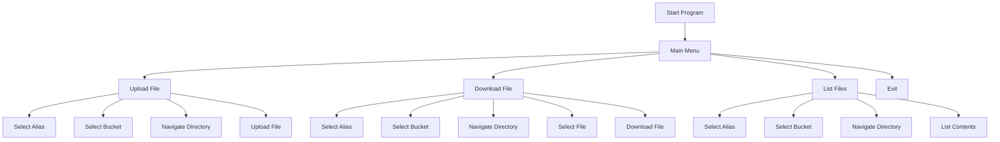

# Starting and Using MinIO CLI Manager

This guide explains how to start and use the MinIO CLI Manager interactive menu.

## Starting the Program

To start the program, simply use:

```bash
mcli start
```

## Program Flow



## Menu Navigation

1. **Main Menu Options**
   - Upload a file
   - Download a file
   - List files
   - Exit script

2. **Common Flow for All Operations**
   - Select MinIO alias
   - Select bucket
   - Navigate directories
   - Perform operation

3. **Directory Navigation**
   - Use numbers to select items
   - 📁 for directories
   - 📄 for files
   - ⬅️ to go back
   - 🏠 to return to main menu

## Tips and Best Practices

1. **Navigation**
   - Use numbers to select options
   - Enter to confirm
   - 0 to return to main menu
   - Clear visual indicators for different types of items

2. **File Operations**
   - Navigate through directories using numbers
   - Select files by number
   - Confirm operations with y/n
   - Use 0 to cancel operations

3. **Error Handling**
   - Invalid choices show error messages
   - Network issues are clearly displayed
   - Permission errors are explained
   - 1-second delay for invalid selections

## Common Issues and Solutions

1. **Menu Not Responding**
   - Check if program is running
   - Try restarting the program
   - Verify terminal settings

2. **Selection Issues**
   - Make sure you're in the correct menu
   - Use numbers for selection
   - Verify file permissions

3. **Navigation Problems**
   - Use 0 to return to main menu
   - Check terminal window size
   - Verify keyboard input 